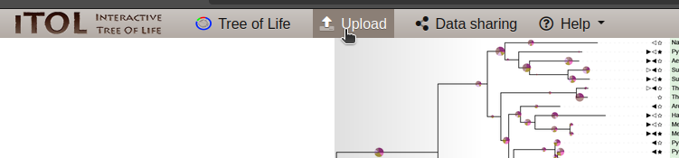
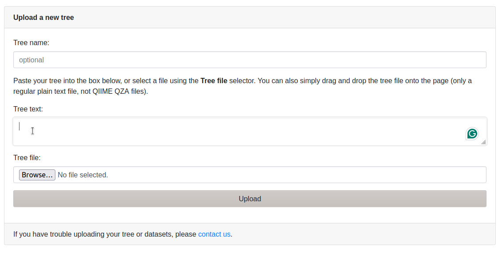
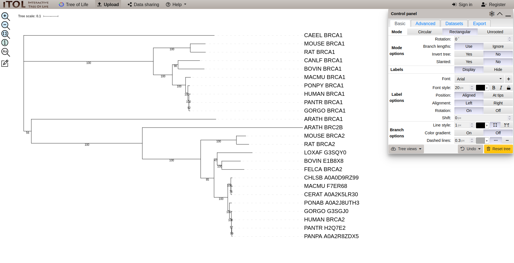
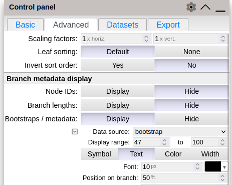
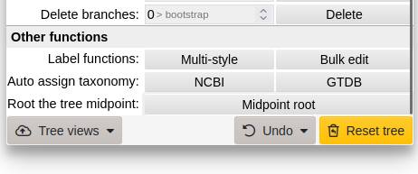

# Reconstrucció filogenètica del gen BRCA

En aquesta pràctica reconstruirem l'arbre del gen BRCA, el qual hem vist que pot estar relacionat amb el càncer de mama. El gen només està a humans? quantes vegades s'ha duplicat? quin és el seu origen?

Totes aquestes qüestions les anirem responent amb els resultats dels passos que anem a dur a terme. Tots aquests procediments els desenvoluparem a la terminal del vostre usuari a MareNostrum 4. Hem instal·lat el software necessari a aquest sistema i anirem seguint els tutorial per a completar els passos que hem comentat a la sessió introductòria.

## Carregar mòduls a MN4 i anar a la carpeta del projecte
```bash
module load tree
cd bojos_genomica/practica_filogenia
```

També crearem una carpeta per als outputs:
```bash
mkdir outputs
```

## Alineament
Per a alinear les seqüències emprarem el software `mafft`, que implementa una sèrie d'algorismes que permeten alinear seqüències de gens o proteïnes. En aquest cas alinearem les seqüències de proteïnes que estan a l'arxiu `data/brca.fa`.

Pots fer una ullada al format de l'arxiu, s'anomena FASTA. Es tracta d'un format que identifica el nom de les seqüències amb el símbol `>` seguit del nom de la seqüència, en la línia següent, o fins a trobar una nova línia que comence amb un `>`, es trobarà la seqüència, e.g.:
```
>nom de la seqüència
AATGCAGTGGATGACAC
```

pots veure les primeres línies de l'arxiu amb la comanda:
```
head data/brca.fa
```

Com pots observar en aquest fitxer les seqüències les hem anomenades amb el nom de l'espècie `CEEL` i el nom del gen `BRCA1` separats per un underscore.

Per a alinear les seqüències de l'arxiu `data/brca_seqs.fa` emprarem la comanda:
```
mafft data/brca.fa > outputs/brca.aln
```

Pots veure l'alineament fent servir `alan`
```bash
alan outputs/brca.aln
```

### Qüestions sobre l'alineament
1. Hi ha posicions amb buits?
2. Com podries explicar aquestes posicions? S'ha pogut partit el gen? s'han eliminat alguns aminoàcids?

## Trimat
En aquest pas emprarem `TrimAl` un software desenvolupat al BSC que ens permet eliminar les posicions de l'alineament que no són informatives per a la filogènia.
```bash
trimal -in outputs/brca.aln -out outputs/brca.trim -gappyout
```

recorda que pots veure l'alineament trimat emprant `alan`
```bash
alan outputs/brca.trim
```

### Questions sobre el trimat
1. Identifiques alguna regió de l'alineament en què s'hagen eliminat posicions?
2. Hi ha seqüències que encara tenen buits (`-`)?
3. Per què creus que s'han conservat aquestes posicions amb algun buit?
4. _Extra_: Podries fer un script que comptara les longituds de l'alineament i de l'alineament trimat per a comprovar quantes posicions s'han eliminat? (pots demanar ajuda, si us interessa en grup el podem programar junts).

## Reconstrucció filogenètica
Per a reconstruir l'arbre filogenètic recorrerem al software `iqtree2`, el qual implementa la inferència de l'arbre amb Maximum Likelihood, la comanda que executarem serà:
```bash
iqtree2 -s outputs/brca.trim --prefix outputs/brca_tree -m LG+G4 -B 1000
```
* `-m`: és l'argument per al model d'evolució `LG` és el model base i `G4` és una ajuda a aquest model per a contrarestar posicions que evolucionen ràpid d'altres que ho fan més lentament.
* `--prefix`: és l'argument que permet indicar on s'escriuran els fitxers d'output.
* `-B`: és l'argument que agafa el nombre de rèpliques de l'arbre que farem servir per a contrarestar la robustesa de l'arbre.
* `-s`: és l'argument per a incorporar l'alineament trimat.

Esperarem uns minuts fins que es trobe l'arbre més ajustat a les dades i podrem visualitzar-lo emprant l'eina online [`iToL`](https://itol.embl.de/). Per a pujar l'arbre a `iToL` farem:

1. click al botó `Upload`:
<br>


2. copiarem l'arxiu de l'arbre de la terminal, per a mostrar-lo en la terminal emprarem la comanda `cat` que mostra el contingut d'un fitxer de text:
```bash
cat outputs/brca_tree.treefile
```
Copiarem fent botó dret i copiar.

3. Apegarem el text copiat al requadre `Tree text:` i farem click a `Upload`:
<br>


4. Apareixerà una finestra com aquesta:
<br>


Com veieu, apareix l'arbre i un panell de control. Per a mostrar els valors de bootstrap que hem calculat anirem a la pestanya `Advanced` del panell de control, i activarem l'opció `Display` de `bootstraps / metadata`.
<br>


5. Abans d'interpretar l'arbre l'arrelarem. Per a no suposar cap arrel, el que farem és recórrer a un mètode en què no decidim nosaltres l'arrel. Aquest mètode s'anomena midpoint, i deu el seu nom a que posa l'arrel a la branca que està enmig del camí (recorrent les branques) més llarg que es pot fer a l'arbre. <br> Per a fer-ho amb iToL anirem a la pestanya `Advanced` del panell de control i baix del tot (fent scroll) veurem l'opció `Root the tree midpoint`, prem aquesta opció i mira com canvia l'arbre.
<br>

<br>
Amb aquesta opció començarem a interpretar l'arbre.

### Qüestions sobre la filogènia
1. Quantes vegades observes l'espècie `ARATH`?
2. Pots buscar quina és aquesta espècie? Pensaves que aquest gen podria estar present a aquesta espècie?
3. Com pots explicar que aquest gen estiga a una espècie com `ARATH`? (pista: pensa quan es va originar, abans o després de totes aquestes espècies?)
4. Tornem a veure per què apareix dues vegades `ARATH`. Quin procés d'evolució de gens que hem comentat anteriorment podria explicar que hi ha 2 còpies a `ARATH`?
5. On ha pogut passar aquesta duplicació?
6. Busca la còpia de BRCA2 de `CAEEL`, existeix? Per què?
7. Podries reconstruir l'evolució d'aquest gen? Quantes duplicacions hi ha hagut? Hi ha hagut pèrdues d'algun dels dos gens?
